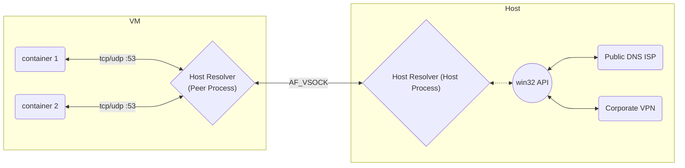

# Host Resolver
A stub DNS resolver that runs on the host machine on Linux, macOS, and Windows. The main goal behind this stub resolver is more robuset handling of domain name resolutions when VPN split tunnel is setup.




## Run

You can run host-resolver in a few different mode:

### 1) DNS Stub Resolver Over AF_VSOCK

In WSL Distro:
```
/host-resolver vsock-peer
```
In Windows Host:
```
/host-resolver vscok-host --built-in-hosts host.rancher-desktop.internal=111.111.111.111
```
### 2) Standalone Server
```bash
/host-resolver run -a 127.0.0.1 -t 54 -u 53 -c "host.rd.internal=111.111.111.111,host2.rd.internal=222.222.222.222"
```
NOTE: If ports are not provided, host resolver will listen on random ports.

## Test

You can run the tests in the container by running:
```bash
docker build -t host-resolver:latest . && docker run --dns 127.0.0.1 -it host-resolver:latest
```
Note: Run with `--dns` flag, this overrides the `/etc/resolv.conf` in the running container.

