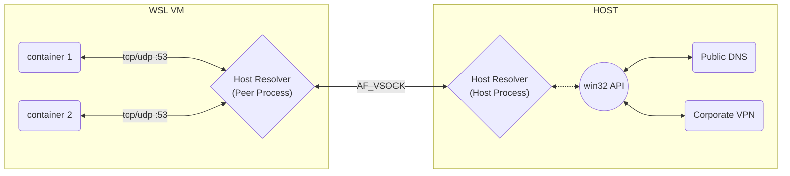

# Host Resolver
A stub DNS resolver that runs on the host machine on Linux, macOS, and Windows. The main goal behind this stub resolver is more robust handling of domain name resolutions when using a VPN split tunnel is setup.

## How Does It Work In Rancher-Desktop?

Below is the current architecture of Rancher Desktop when using host-resolver on Windows:




## Running host-resolver

You can run host-resolver in a few different modes:

### 1) DNS Stub Resolver Over AF_VSOCK

In WSL Distro:
```
/host-resolver vsock-peer
```
In Windows Host:
```
/host-resolver vsock-host --built-in-hosts host.domain.example=192.0.2.3
```
### 2) Standalone Server
```bash
/host-resolver standalone --listen-address 127.0.0.1 --tcp-port 54 --udp-port 53 --upstream-servers "host.rd.internal=111.111.111.111,host2.rd.internal=222.222.222.222"
```
NOTE: If ports are not provided, host resolver will listen on random ports.

## Test

You can run the tests in the container by running:
```bash
docker build -t host-resolver:latest . && docker run --dns 127.0.0.1 -it host-resolver:latest
```
## E2E Test

You can run the e2e tests locally on a windows machine, please note that the e2e tests need to run
as an administrator in an elevated terminal (e.g. Administrator: Windows Powershell).

```bash
go test -v .\test\e2e\...
```
NOTE: the e2e test updates the DNS addresses on the machine's PRIMARY interface (e.g WiFi, eth0, etc)
the determination process assumes the addresses are dynamically configured through DHCP, this is to prevent
any changes to other interfaces e.g. VirtualBox Host-Only Network, vEthernet (WSL). Once the test is terminated
the interfaces and DNS changes are restored to the original state.

**Note:** Run with `--dns` flag is required to override the DNS resolver used in the container.

